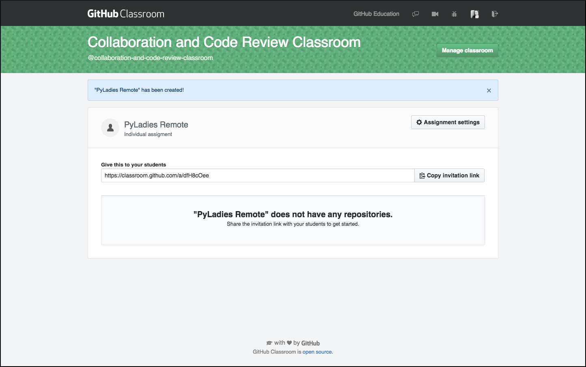

# PyLadies Remote Simulation Exercise

# Table of Contents

- [GitHub Classroom](#github-classroom)
- [Submitting a Shared Repository Pull Request](#submitting-a-shared-repository-pull-request)
- [Forking and Submitting a Forked Repository Pull Request](#forking-and-submitting-a-forked-repository-pull-request)
 
:top: [**back to top**](#table-of-contents)

## GitHub Classroom

<!--

-->

I will give you a link which will open a page where you can click "Accept the assignment". You might need to be logged into GitHub to proceed. 

A new page will open with a link at the bottom to click on to go to your repo

In the organization account will be a repo similar to mine (pyladies-remote-KatherineMichel), with your username. You will have "admin" privileges to this repo. 

:top: [**back to top**](#table-of-contents)

## Submitting a Shared Repository Pull Request

:top: [**back to top**](#table-of-contents)

## Forking and Submitting a Forked Repository Pull Request

<!--
images/github-forked-repo-master-branch-after-new-branch.png
 -->
 

:top: [**back to top**](#table-of-contents)

